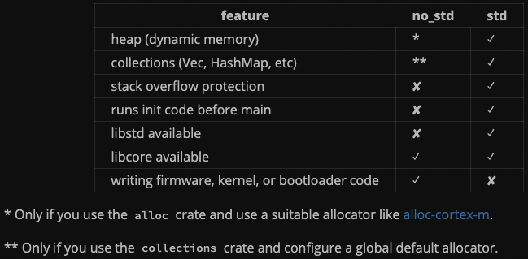

###### _by just-do-halee_

# _Today I learned_

## 2022-9-16

<br>

- Rust::Embedded

  - ::`#![no_std]`

    - _Standard Library_(`std`)가 아닌 _Core Library_(`core`)에 링크하겠다는 crate-level 지시자이다. 축약해서, 운영체제에 의존하지 않겠다는 선언이다.

    - *no_std*와 *std*의 차이:

      

      *no_std*는 Heap과 Collections가 기본적으로 주어지지 않는다. 다만 하드웨어에 따른 Allocator를 따로 지정해줘야 하는 작업이 필요하다.
      또한 Stack Overflow Protection이 존재하지 않는다. 표준 라이브러리(libstd) 대신 코어 라이브러리(libcore)만 사용할 수 있다.
      마지막으로, 펌웨어(firmware), 커널(kernal), 부트로더(bootloader) 등 개발이 가능해진다. 운영체제 의존인 기존 std로는 불가능했다.

  <br>

  - ::`[profile.release]`

    - 프로그램의 바이너리 사이즈를 줄일 수 있는 옵션이 몇 가지 존재한다.

      ```toml
      [profile.release]
      strip = true # Automatically strip symbols from the binary
      opt-level = "s" # Optimize for size, not runtime speed
      lto = true # Enable link time optimization
      codegen-units = 1 # Maximize size reduction optimizations
      ```

      또는 [`cargo-bloat`](https://crates.io/crates/cargo-bloat) CLI의 힘을 빌릴 수도 있겠다(이때에는 `strip`을 `false`로 두고 실행해야 한다.)

      자세한 사항들은 [_min-sized-rust_](https://github.com/johnthagen/min-sized-rust)를 참고하면 된다.

<br><br>

##### **_[`| Back to list |`](../../README.md)_**
