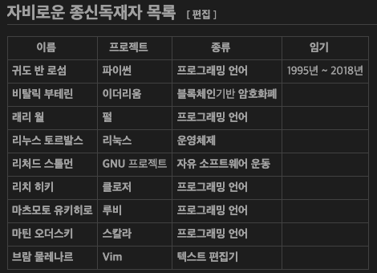

###### _by just-do-halee_

# _Today I learned_

## 2022-9-21

 

- Rust::Basic

  - ::SmartPointer

    - 어떤 데이터 타입 혹은 구조체가 `Heap에 존재하면 이득일 지를 생각`해보면 된다. (`컴파일 시간 때 데이터의 크기를 알 수 없을 경우`.. 등)
    - 그 외의 것들은 `Stack용 타입`으로서 `Copy` Trait이 자동적으로 적용되어 있다.
    - `Heap용 데이터` 타입은 `Clone` Trait이 유용하게 적용되어질 수 있으며 Copy Trait은 구현 불가능하다.
    - `Heap용 타입`은 Rust 내에서 `기본적으로 Smart Pointer`로 취급된다.
    - Scope를 벗어나면 Stack은 자동 할당해제가 되며, `Smart Pointer일 경우` 할당해 보존하고 있던 `Heap 메모리 일부 또한 할당해제하고 drop`된다.

     

    - ::참고::

      - _`Copy` Trait이 적용되어 있지 않은 경우 (`Heap`을 가리키는 `SmartPointer`일 경우), 값의 `소유권은 단 하나`로 제한이 되며, 이는 Rust Runtime에 의해 `Memory Double Free, Dangling Pointer 등의 사태를 미연에 방지`할 수 있다._ 이들은 심각한 보안 붕괴를 일으키는 보안 취약점 중의 하나이다.

   

  - ::Reference

    - Reference(&)는 단지 `Pointer`이다. Ownership의 소유자의 메모리주소를 가리킨다.
    - 하나의 Ownership에 대하여 `많은 수의 References(&)` 또는 `단 하나의 Mutable reference(&mut)` 둘 중 하나만 같은 Lifetime 내에 존재할 수 있다. 이는 `Data Race를 방지하기 위함`이다.
    - 하나의 Ownership에 연계된 많은 수의 Reference와 하나의 Mutable reference가 동시에 존재할 경우, 그 원본 값이 Mutable reference에 의하여 변경될 경우 동시에 (다른 스레드에서이든) 존재하는 모든 Reference들 또한 변경이 이루어지기 때문이고, 마찬가지로 여러 Mutable reference들이 동시에 (다른 스레드에서이든) 존재할 경우 서로 너도나도 원본 값을 변경하기 때문에 `프로그램 자체가 예측 불가능`해지기 때문이다. 이를 방지하기 위함으로 위와 같은 `두 가지 경우의 수만을 Rust는 한정`한다.

 

- OS::History

  - 1956년, 자동차 회사 `제너럴 모터스(General Motors)`에서 IBM704에 쓰일 최초의 운영체제 `GM-NAA I/O` 개발.
  - 이후 `IBM 메인프레임용` 운영체제로서 고객들 측에서 여러 모로 개발해왔다.
  - 196X년, 당대 최고의 정보통신업체였던 `벨 연구소`에서 운영체제 `UNIX` 개발.
  - 벨 연구소의 신입 사원 [켄 톰슨](https://ko.wikipedia.org/wiki/%EC%BC%84_%ED%86%B0%ED%94%84%EC%8A%A8)이 벨 연구소의 미니 컴퓨터 PDP-7을 이용하여 `Space Wars`라는 이름의 컴퓨터 게임을 개발하기 시작. 그러나 게임 개발에 필요한 여러 환경이 당시 운영체제로는 턱없이 부족하였기에 `운영체제를 아예 새로 만들기로 결심.`
  - 1969년, 켄 톰슨을 시작으로 같은 연구소 연구원 [데니스 리치](https://ko.wikipedia.org/wiki/%EB%8D%B0%EB%8B%88%EC%8A%A4_%EB%A6%AC%EC%B9%98) 등과 함께 1974년 `UNIX`의 정식 발표.
  - 초창기 오픈소스로 공개되었던 UNIX는 여러 기관들에서 가져다 각자 입맛대로 개조해 사용하기 시작해 SUN의 `SunOS/Solaris`, IBM의 `AIX`, HP의 `UP-UX`, MS의 `XENIX`, DEC의 `Ultrics` 등 각종 변종 운영체제를 탄생시키는 기원이 되었다.
  - 그러나 위의 기업용 운영체제는 모두 워크스테이션급의 고성능 컴퓨터를 위한 무거운 운영체제들이었기에 개인은 범접할 수가 없던 차, `디스켓 한 장으로 간단하게 작동`시킬 수 있는 운영체제 `DOS(Disk Operating System)`가 등장.
  - 빌 게이츠의 `MS-DOS`는 10년간 운영체제 시장의 선두를 차지했다.
  - MS-DOS의 시대에 핀란드 출신 [리누스 토발즈(Linus Torvalds)](https://ko.wikipedia.org/wiki/%EB%A6%AC%EB%88%84%EC%8A%A4_%ED%86%A0%EB%A5%B4%EB%B0%9C%EC%8A%A4)는 `1991년, 자신의 이름을 본딴 Linux라는 운영체제를 컴퓨터 통신을 이용해 배포`했다.
  - UNIX를 모태로 개발된 `Linux`는 무료인 데다 `오픈소스`로서 공개되어 있으며 개인용 컴퓨터에서 또한 가볍게 작동시킬 수 있어 전세계 개발자들 사이에서 인기를 독식했다.

   

  - ::참고::

    - 켄 톰슨은 B언어를 만들었고, 데니스 리치는 B언어를 발전시켜 C언어를 만들었으며 1969년 켄 톰슨이 단독으로 어셈블리어로 작성한 초기 UNIX 버전을 C언어로 바꾸는 데에 기여했다.
    - DOS(Disk Operating System)는 디스켓을 통한 부팅이 가능한 모든 운영체제를 지칭하는 용어이다.
    - 리누스 토발즈는 버전 관리 프로그램 Git 또한 개발한 장본인이다.

 

- OS::Linux

  - UNIX를 모태로 개발되긴 했으나 운영체제의 핵심인 `커널(Kernel)`을 포함한 거의 모든 초기의 소스코드는 리누스 토발즈가 독자적으로 구현했다.

  - 특징

    1. `개인용 컴퓨터`에서조차 사용할 수 있다.

       - 초창기 UNIX 및 그 계열 OS 라인은 Alpha, SPARC 등 특정 CPU에서만 작동할 수 있었는데, 이에 반해 `Linux`는 인텔(Intel)의 8038b 등 `일반 가정집용 x86 계열 CPU에서 동작하는 것이 가능했다.`

    2. `멀티유저시스템(Multi-User System)`을 지원한다.

       - 고성능 컴퓨터의 가격 차이가 극심했던 시절, 한 대의 고성능 컴퓨터를 `다른 이용자들이` 서로 순차적으로 이용했어야 했던 MS-DOS나 MS-Windows와는 다르게 Linux OS에서는 `동시에 이용하는 것이 가능`했다.

    3. `가볍고 안정적`이다.

       - `작고 가벼운 기능들`로 조합된 데에 이어 `꼭 필요한 기능들`로 구성돼 있기에 포터블하며 저사양 하드웨어에서 `높은 수준의 퍼포먼스`를 선보일 수 있다.

    4. `무료`이며 `소스코드가 공개`되어 있다.

       - 운영체제 자체는 물론 자체 내장 `유용한 소프트웨어들까지 모두 무료`인 데다, 그 `모든 소스코드가 오픈`되어 있어 능력만 된다면 시스템을 자기 입맛대로 `커스터마이징`하는 것이 가능해진다.

    5. `전세계가 함께 만들어 나가는 운영체제이다.`

       - 전세계 능력 있는 개발자들에 의해 `지속적이고도 발빠른 업데이트`가 이루어진다.

     

    - ::참고::

      - Linux 이전에도 Minix라는 이름의 x86 CPU를 지원하는 OS가 존재하긴 하였으나 Linux가 가진 보다 나은 장점들로 인해 Minix 이용자들은 하나둘씩 Linux로 갈아타기 시작했다.

 

- Network::Basic

  - 모든 주택의 전화선은 전봇대를 통해 `동도`라 불리는 전화국의 지하터널로 들어가 모인다. 그 후 전화국을 지나 `ISP(Internet Service Provider)`로 연결된다.
  - 만일 자택에서 패킷을 만들어 송신할 시, *전화선 -> 전봇대 -> 동도 -> 전화국 -> ISP*로 배달이 돼, *ISP 내에 설치된 `라우터(Router)`에까지 도달*하게 된다.
  - 라우터에는 그 지역의 모든 컴퓨터들이 연결되어 있고, 또한 다른 `ISP들과도 연결`되어 있다.
  - 라우터는 수신 IP를 확인하고 그에 적합한 목적지로 패킷을 송신해주는 마치 전신전화국의 `교환대 역할`을 맡고 있다.
  - 라우터의 중요한 역할 중 하나는 이어진 `수 많은 길들 가운데 가장 빠른 최적의 길을 찾아내는 것`이다.
  - 1개의 `패킷(Packet)`이란 `헤더`와 `보낼 데이터` 두 가지가 합친 것이다. 이 `헤더에는 보내는이 IP와 받는이 IP` 등의 정보가 포함되어 있다.
  - 1개의 패킷을 소포로 비유할 수 있고, 거쳐가는 우체국들을 라우터들로 비유할 수 있다. 수신 컴퓨터는 헤더를 확인한 후에는 따로 떼어낸 뒤 `보내진 데이터`만을 따로 떼어내 갖는다.

 

- Git

  - 보다 나은 깃 커밋 메시지를 작성하는 법

    1. `첫 문자는 무조건 대문자`로 시작해라. 그리고 마지막은 `결코 구두점으로 끝내선 안 된다.`
    2. 메시지는 `명령형으로 작성`해라. 하나의 커밋은 마치 신의 명령처럼 들려야 한다. ex:) Add dark mode toggle component
    3. 커밋 `종류를 키워드로 분류`하라. ex:) Bugfix, Update, Refactor, Bump... etc
    4. `너무 길게 써서는 안 된다.` 첫째 줄은 50문자 이하, 나머지는 72문자 이하로 써라.
    5. 최대한 간결하게 `필요한 단어만을 사용`하라. 불필요한 부사나 감정이 들어간 문장들은 생략하라. 저널리스트가 된다고 여겨라.

 

- CommandLineTools

  - [tldr](https://tldr.sh): 명령줄 도구(Command Line Tool)들의 요약본을 보여주는 툴.
  - [nslookup](https://manned.org/nslookup): 도메인 네임 서버(Domain Name Server: DNS)에 쿼리를 날릴 수 있게 도와주는 툴.
  - [netstat](https://man7.org/linux/man-pages/man8/netstat.8.html): 현재 연결 되었거나 열려 있는 포트 및 IP주소 리스트를 보여주는 툴.
  - [nc](https://nmap.org/ncat): Netcat. TCP 또는 UDP 데이터를 다룰 수 있는 다용도 툴.
  - [ifconfig](https://net-tools.sourceforge.io/man/ifconfig.8.html): 네트워크 환경설정용 툴.

 

- ETC

  - 자비로운 종신독재자(Benevolent Dictator for Life: `BDFL`): 소수의 오픈소스 개발 리더에게 부여되는 칭호이다. 주로 커뮤니티 내에서 논쟁이 있을 때 최종적으로 결론을 내려줄 수 있는, 프로젝트 창시자인 경우가 많다. 이 표현은 1995년에 파이썬의 창시자 귀도 반 로섬을 가리키는 호칭으로 처음 사용되었다.

    

  

##### **_[`| Back to list |`](../../README.md)_**
